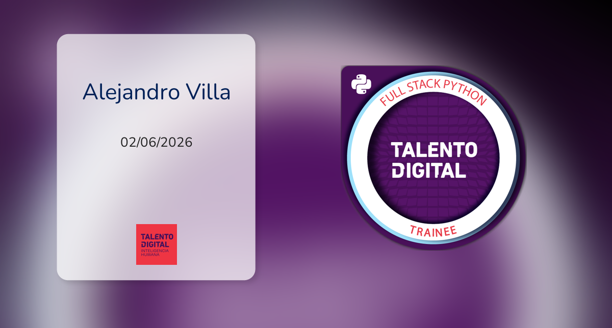

<!--
  README de PERFIL de GitHub.
  Este archivo va en un repositorio que debe llamarse EXACTAMENTE igual
  que tu usuario: alejandro-villa-dev. GitHub lo muestra automáticamente
  arriba de tus repositorios en https://github.com/alejandro-villa-dev
-->

  

  

<h3 align="center">¡Hola! Soy Alejandro Villa 👋</h3>

  Soporte técnico, ITSM e infraestructura, combinado con desarrollo web
  en Angular/Ionic y bases de Python/Django.

  
  
  

---

### 🧭 Sobre mí

Ingeniero Informático con experiencia real en soporte técnico N1/N2,
Active Directory e ITSM (GLPI/ServiceNow), que complementa esa base con
desarrollo de software. Actualmente construyo un sistema propio de
gestión de inventario TI (Python/Django), pensado para técnicos de
soporte que necesitan resolver justo los problemas que yo mismo he vivido
en terreno.

Disponible para trabajo **100% remoto**.

### 🛠️ Stack

  
  
  
  
  
  
  
  

**Soporte e infraestructura:** Active Directory · GLPI · ServiceNow ·
Windows Server · TCP/IP · Mesa de ayuda bajo SLA

### 🎓 Título y credenciales

  
  &nbsp;&nbsp;&nbsp;
  

**Ingeniería en Informática – Duoc UC (2020–2025)**
Título verificable mediante sistema oficial de validación QR de Duoc UC.
[Verificar título](https://certificadovalida.duoc.cl/ValidacionQr?id=1649840354)
> Nota para procesos en México: en Chile no se utiliza una cédula profesional
> equivalente a la mexicana como documento estándar para acreditar este
> título. La autenticidad puede verificarse mediante el QR oficial de Duoc UC
> y el enlace indicado.

**Python Full Stack Trainee – ECAS Otec / SENCE (Finalizado 2026)**
Credencial digital verificable en Acreditta.
[Ver credencial](https://acreditta.com/credential/6c865bcb-91f2-44fe-908e-1c512c71cfff)

### 📌 Proyectos destacados

- **[Portafolio personal](https://github.com/alejandro-villa-dev/Portafolio-Angular-Firebase)**
  — Angular + Ionic + Firebase, con SEO dinámico y arquitectura por
  componentes/servicios/modelos.
- **Sistema de Gestión de Inventario TI** *(en desarrollo)* — Python/Django,
  pensado para organizaciones pequeñas y medianas, con módulos de roles,
  sedes, ubicaciones y trabajadores. Próximamente en este perfil.

### 📫 Contáctame

- ✉️ [alejandro.villa91@gmail.com](mailto:alejandro.villa91@gmail.com)
- 💼 [LinkedIn](https://www.linkedin.com/in/alejandro-villa-villavicencio/)
- 🌐 [Portafolio](https://portafolio-alejandro-villa.web.app)
